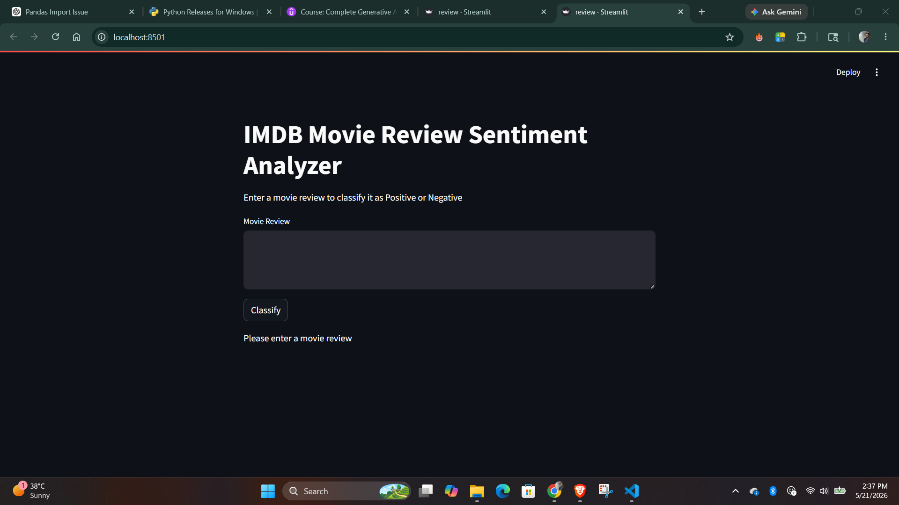
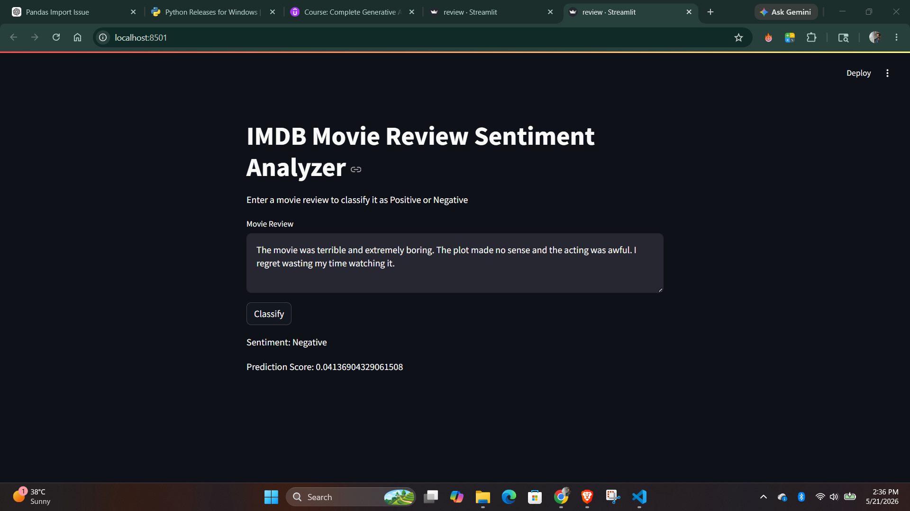

# IMDB Movie Review Sentiment Analyzer

A Deep Learning based sentiment analysis web application built using:
- TensorFlow
- Keras
- Streamlit
- Simple RNN

The application predicts whether a movie review is:
- Positive
- Negative

---

# Features

- IMDB dataset based sentiment analysis
- Simple RNN model
- Streamlit web interface
- Real-time prediction
- TensorFlow/Keras implementation

---
# Application Preview

## Home Page



---

## Prediction Output



# Tech Stack

- Python 3.10
- TensorFlow 2.17
- Keras
- Streamlit
- NumPy
- Pandas

---

# Project Structure

```text
RNN_Project/
│
├── review.py
├── simple_RNN.ipynb
├── prediction.ipynb
├── word_embedding.ipynb
├── requirements.txt
├── simple_rnn_imdb.keras
├── README.md
├── .gitignore
├── images/
│   ├── RNN-home.png
│   └── RNN-output.png